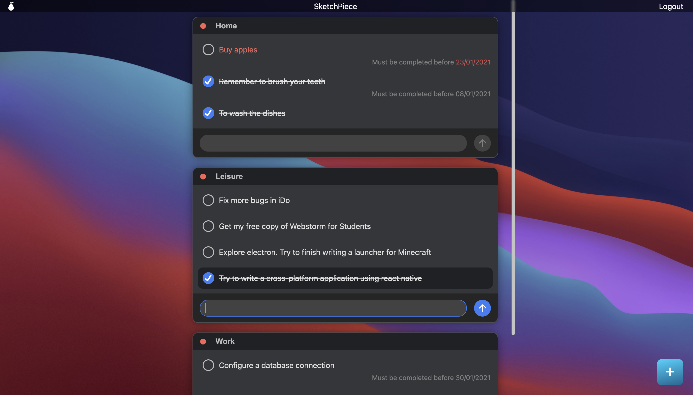

<p align="center">
  <a href="https://ido-todo.herokuapp.com/" target="blank"></a>
</p>

<h1 align="center">iDo</h1>

## Description

An advanced todo application made in the style of macOS Big Sur



## Technologies

- [Nest.js](https://nestjs.com/)

- [SQLite](https://www.sqlite.org), [Postgres](https://www.postgresql.org/)

- [Vue3](https://v3.vuejs.org/)

- [SASS(SCSS)](https://sass-lang.com/) preprocessor

## Installation

```bash
# backend dependencies
$ npm install
```

```bash
# frontend/client dependencies
$ npm run client:install
```

## Running the app

### Backend:

```bash
# backend development
$ npm run start

# backend watch mode
$ npm run start:dev

# build backend for production mode
$ npm run build

# backend production mode
$ npm run start:prod
```

### Frontend:

```bash
# frontend/client development
$ npm run client:serve

# build frontend/client for production mode
$ npm run client:build
```

# Configurations

All backend configurations are in `src/constants.ts` file

**JWT_SECRET** - secret key to create jwt token

**JWT_EXPIRES_IN** -
lifetime of the authorization token in milliseconds

**DB_OPTIONS** -
database connection settings in development and production mode

# Todo

- [ ] Сhange the arrangement of tasks in projects
- [ ] OS Mode (interacting with windows as in the operating system)
- [ ] Mobile version
